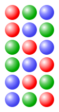

<!-- @import "[TOC]" {cmd="toc" depthFrom=1 depthTo=6 orderedList=false} -->

<!-- code_chunk_output -->

- [Hoán vị (Permutation)](#hoán-vị-permutation)
- [Chỉnh hợp (Partial Permutaion)](#chỉnh-hợp-partial-permutaion)
- [Tổ hợp (Combination)](#tổ-hợp-combination)
- [Chỉnh hợp lặp](#chỉnh-hợp-lặp)
- [Tổ hợp lặp](#tổ-hợp-lặp)
- [Số nguyên tố cùng nhau (Coprime integers)](#số-nguyên-tố-cùng-nhau-coprime-integers)
- [Phép chia có dư (Euclidean division)](#phép-chia-có-dư-euclidean-division)

<!-- /code_chunk_output -->

# Hoán vị (Permutation)

Cho tập hữu hạn $S$ kích thước $n$ phần tử ($n \in \mathbb{N}$), mỗi mẫu (bộ) kết quả của sự sắp xếp thứ tự $n$ phần tử là một Hoán vị của tập (trong một tập thì các phần tử là phân biệt, không lặp, tức mỗi phần tử là duy nhất).

Nói cách khác, nếu gọi $I$ là tập các số $\mathbb{N}$ từ $1$ đến $n$ (tập chỉ mục của $S$): $\lbrace 1, 2, ..., n\rbrace$. Khi đó, mỗi Hoán vị của $S$ là một Song ánh $f:I\to S$.

Khi khai triển một Hoán vị của tập kích thước $n$ phần tử (ở đây giả sử rằng $n>2$):

Vì tập kích thước $n$ phần tử hiển nhiên có $n$ phần tử để chọn phần tử thứ nhất $\Rightarrow$ Vì vậy có thể nói, có $n$ cách để khai triển một Hoán vị của tập.

Vì đã dùng $1$ phần tử bất kì để chọn trong $n$ phần tử nên ta còn $n-1$ phần tử để chọn cho thứ tự kế tiếp $\Rightarrow$ Vì vậy có $n(n-1)$ cách để khai triển một Hoán vị của tập.

Vì đã sử dụng $2$ phần tử bất kì để chọn trong $n$ phần tử nên ta còn $n-2$ phần tử để chọn cho thứ tự kế tiếp $\Rightarrow$ Vì vậy có $n(n-1)(n-2)$ cách để khai triển một Hoán vị của tập.

...

Tóm lại, nếu đã sử dụng $i$ phần tử bất kì để chọn trong $n$ phần tử $(0 \leq i < n, i \in \mathbb{Z})$, thì ta còn $n-i$ phần tử để chọn cho thứ tự thứ $i+1$ $\Rightarrow$ Vì vậy sẽ có $n(n-1)(n-2)...(n-i)$ cách để khai triển một Hoán vị của tập.

Cho đến phần tử thứ $n$, vì đã dùng $n-1$ phần tử bất kì trong $n$ phần tử để chọn, chỉ còn $n-(n-1)$ phần tử để chọn cho thứ tự thứ $n \Rightarrow$  Vì vậy có $n(n-1)(n-2)...(n-n+1)$ cách để khai triển một Hoán vị của tập.

$\implies$ Như vậy, một tập có kích thước $n$ phần tử có tối đa $n!$ cách để khai triển một Hoán vị:

$$P(n)=n!$$

# Chỉnh hợp (Partial Permutaion)

*Chỉnh hợp không lặp hay Chỉnh hợp*

Cho $S$ là một tập hữu hạn gồm $n$ phần tử với $k$ là một số tự nhiên bé hơn $n$, gọi $K$ là tập các số $\mathbb{N}$ từ $1$ đến $k$: $\lbrace 1, 2, ..., k\rbrace$

Với $k \lt n$, khi đó mỗi Chỉnh hợp chập $k$ của $S$ là một Đơn ánh $f:K\to S$.

Tổng số chỉnh hợp chập $k$ của $S$ được kí hiệu và được tính bằng công thức có được xuất phát từ hành vi tính tổng số hoán vị (Chỉnh hợp là Hoán vị một phần):

$$ P(n,k)=\frac{n!}{(n-k)!}$$

Với $k=n$, $K$ trở thành tập chỉ mục $I$ của $S$, mỗi Hoán vị của $S$ là một Song ánh $f:K\to S$.

# Tổ hợp (Combination)

*Tổ hợp không lặp*

Cho $S$ là một tập hữu hạn gồm $n$ phần tử với $k$ là một số tự nhiên bé hơn hoặc bằng $n$.

Mỗi Tổ hợp chập $k$ của $S$ được định nghĩa là một tập con gồm $k$ phần tử của $S$.

Có thể thấy, mỗi Tổ hợp chập $k$ của $S$ chính là "một nhóm" gồm các chỉnh hợp chập $k$ của $S$ mà giữa chúng không có sự khác biệt về mặt phần tử. Tức, sẽ luôn luôn tìm được $k!$ mẫu trong tổng số chỉnh hợp chập $k$ của $S$ sao cho tạo thành một Tổ hợp (tập con) chập $k$ của $S$. Vì vậy, Tổng số tổ hợp chập $k$ của một tập có thể tính được dựa trên phép tỉ lệ từ hành vi tính tổng số chỉnh hợp chập $k$ của nó.

Cụ thể, kí hiệu và gọi $C(n,k)$ là biến số thể hiện tổng số tổ hợp chập $k$ của $S$, ta có:

$$ C(n,k)k! = \frac{n!}{(n-k)!} $$

$$ \Rightarrow C(n,k) = \frac{n!}{(n-k)!k!} $$

# Chỉnh hợp lặp

Cho $S$ là một tập hữu hạn gồm $n$ phần tử với $k$ là một số tự nhiên, gọi $K$ là tập các số $\mathbb{N}$ từ $1$ đến $k$: $\lbrace 1, 2, ..., k\rbrace$

Mỗi Chỉnh hợp lặp chập $k$ của $S$ là một Ánh xạ (có thể toàn ánh hoặc không) $f:K\to S$.

# Tổ hợp lặp

# Số nguyên tố cùng nhau (Coprime integers)

*coprime integers*

Các số nguyên được gọi là số nguyên tố cùng nhau nếu ước chung duy nhất của chúng là $1$. Tính chất này không khẳng định chúng là số nguyên tố. Chẳng hạn, $6$ và $35$ đều không phải là số nguyên tố vì chúng đều có thể được phân tích thành tích của các thừa số nguyên tố: $6 = 2 \times 3$ và $35 = 5 \times 7.$ Tuy nhiên, $6$ và $35$ nguyên tố cùng nhau vì chúng không có một thừa số chung nào.

# Phép chia có dư (Euclidean division)

*Euclidean division – or division with remainder*

Trong Số học (arithmetic), phép chia Euclid hay phép chia có dư: quá trình chia một số nguyên (số bị chia, the dividend) cho một số nguyên khác $0$ (số chia, the divisor) theo cách tạo ra thương số nguyên (quotient) và dư số nguyên không âm (remainder) nhỏ hơn giá trị tuyệt đối của số chia.

Ví dụ trực quan (intuitive exam):

Giả sử một chiếc bánh có $9$ miếng và chúng được chia đều cho $4$ người. Dùng phép chia Euclide, $9$ chia cho $4$ được $2$ dư $1$. Nói cách khác, mỗi người được $2$ miếng bánh và còn thừa $1$ miếng.

Điều này có thể được xác nhận bằng cách sử dụng phép nhân, nghịch đảo của phép chia: nếu mỗi người trong số $4$ người nhận được $2$ lát thì tổng cộng sẽ có $4 \times 2 = 8$ lát. Cộng $1$ lát còn lại thì được $9$ lát. Tóm lại: $9 = 4 \times 2 + 1.$

Nói chung, nếu số lượng lát cắt được biểu thị $a$ và số lượng người được được biểu thị $b$, khi đó người ta có thể chia đều chiếc bánh cho mọi người sao cho mỗi người nhận được $q$ với $r$ lát là phần còn lại. Trong trường hợp đó, ta có phương trình:

$$ a = bq + r, $$

$$ 0 \leq r \lt b, $$

$$ bq \leq a, q \in \mathbb{Z}^{0+}$$

Phép chia Euclide cũng có thể được mở rộng thành số bị chia âm (hoặc số chia âm) bằng cách sử dụng cùng một công thức nhưng thêm ràng buộc giá trị tuyệt đối cho số chia trong miền giá trị của $r$ đồng thời mở rộng miền giá trị của $q$:

$$ a = bq + r, $$

$$ 0 \leq r \lt \vert b \vert, $$

$$ bq \leq a, q \in \mathbb{Z}$$

$q$: thương số nguyên, thương hụt (khi $r \gt 0$)

$r$: số dư (số nguyên không âm)

Ví dụ:

+ $111/11$:

    $111 = 10 \times 11 + 1$

    $q = 10$

    $r = 1$

+ $111/-11$:

    $111 = -10 \times -11 + 1$

    $q = -10$

    $r = 1$

+ $-111/11$:

    $-111 = -11 \times 11 + 10$

    $q = -11$

    $r = 10$

+ $-111/-11$:

    $-111 = 11 \times -11 + 10$

    $q = 11$

    $r = 10$