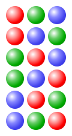

<!-- @import "[TOC]" {cmd="toc" depthFrom=1 depthTo=6 orderedList=false} -->

<!-- code_chunk_output -->

- [Ánh xạ (Map)](#ánh-xạ-map)
- [Dãy (Sequence of numbers)](#dãy-sequence-of-numbers)
- [Hoán vị (Permutation)](#hoán-vị-permutation)
- [Chỉnh hợp (Partial Permutation)](#chỉnh-hợp-partial-permutation)
- [Tổ hợp (Combination)](#tổ-hợp-combination)
- [Số nguyên tố cùng nhau (Coprime integers)](#số-nguyên-tố-cùng-nhau-coprime-integers)
- [Phép chia có dư (Euclidean division)](#phép-chia-có-dư-euclidean-division)

<!-- /code_chunk_output -->

# Ánh xạ (Map)

Một ánh xạ $f$ từ một tập hợp $X$ tới một tập hợp $Y$ ($f:X\to Y$): một ràng buộc mỗi phần tử $x \in X$ (từ tập nguồn) với một và chỉ một phần tử xác định $y \in Y$ (tới tập đích), các phần tử $y$ được xác định gọi là ảnh của các phần tử ánh xạ.

# Dãy (Sequence of numbers)

là kết quả thu được khi viết liên tiếp các con số, có trật tự theo một quy tắc nào đó. Dãy số có thể vô hạn hoặc hữu hạn về số lượng phần tử là các con số, ví dụ:

Cho dãy số u khi viết dưới dạng khai triển: $u_1, u_2, u_3, u_4, …, u_n, …$

Thì $u$ là một dãy số vô hạn.

Cho dãy số $v$ khi viết dưới dạng khai triển: $v_1, v_2, v_3, v_4, …, v_n.$

Thì $v$ là một dãy số hữu hạn.

Dãy hội tụ...

# Hoán vị (Permutation)

Một tập có kích thước $n$ phần tử ($n \in \mathbb{N}$) được sắp xếp theo một trật tự: mỗi một phần tử được chọn (sắp xếp) *theo thứ tự xác định* tạo thành một bộ chứa các phần tử có trật tự xác định của tập. Mỗi bộ có trật tự xác định được gọi là một Hoán vị của tập (trong một tập thì các phần tử phân biệt). Như vậy, theo đó có thể định nghĩa:

Cho $S$ là một tập hữu hạn gồm $n$ phần tử, gọi $I$ là tập con các số $\mathbb{N}$ từ $1$ đến $n$ (tập chỉ mục của $S$): $\lbrace 1, 2, ..., n\rbrace$. Khi đó, mỗi Song ánh $f:I\to S$ được gọi là một Hoán vị của $S$.

Khi khai triển một Hoán vị của tập kích thước $n$ phần tử (ở đây giả sử rằng $n>2$):

Vì tập kích thước $n$ phần tử hiển nhiên có $n$ phần tử để chọn phần tử thứ nhất $\Rightarrow$ Vì vậy có thể nói, có $n$ cách để khai triển một Hoán vị của tập.

Vì đã dùng $1$ phần tử bất kì để chọn trong $n$ phần tử nên ta còn $n-1$ phần tử để chọn cho thứ tự kế tiếp $\Rightarrow$ Vì vậy có $n(n-1)$ cách để khai triển một Hoán vị của tập.

Vì đã sử dụng $2$ phần tử bất kì để chọn trong $n$ phần tử nên ta còn $n-2$ phần tử để chọn cho thứ tự kế tiếp $\Rightarrow$ Vì vậy có $n(n-1)(n-2)$ cách để khai triển một Hoán vị của tập.

...

Tóm lại, nếu đã sử dụng $i$ phần tử bất kì để chọn trong $n$ phần tử $(0 \leq i < n, i \in \mathbb{Z})$, thì ta còn $n-i$ phần tử để chọn cho thứ tự thứ $i+1$ $\Rightarrow$ Vì vậy sẽ có $n(n-1)(n-2)...(n-i)$ cách để khai triển một Hoán vị của tập.

Cho đến phần tử thứ $n$, vì đã dùng $n-1$ phần tử bất kì trong $n$ phần tử để chọn, chỉ còn $n-(n-1)$ phần tử để chọn cho thứ tự thứ $n \Rightarrow$  Vì vậy có $n(n-1)(n-2)...(n-n+1)$ cách để khai triển một Hoán vị của tập.

$\implies$ Như vậy, một tập có kích thước $n$ phần tử có tối đa $n!$ cách để khai triển một Hoán vị:

$$P(n)=n!$$

# Chỉnh hợp (Partial Permutation)

Cho $S$ là một tập hữu hạn gồm $n$ phần tử và $k$ là một số tự nhiên, gọi $K$ là tập con các số $\mathbb{N}$ từ $1$ đến $k$: $\lbrace 1, 2, ..., k\rbrace$:

Với $k \gt n$, mỗi Ánh xạ (có thể toàn ánh hoặc không) $f:K\to S$ đều là một Chỉnh hợp lặp chập $k$ của $S$.

Với $k \lt n$, khi đó mỗi Đơn ánh $f:K\to S$ là một Chỉnh hợp không lặp (hay Chỉnh hợp) chập $k$ của $S$. Tổng số chỉnh hợp chập $k$ của $S$ được kí hiệu và được tính bằng công thức có được xuất phát từ hành vi tính tổng số hoán vị của tập (Chỉnh hợp không lặp là Hoán vị một phần):

$$ P(n,k)=\frac{n!}{(n-k)!}.$$

Với $k=n$, $K$ trở thành tập chỉ mục $I$ của $S$, mỗi Song ánh $f:K\to S$ là một Hoán vị của $S$.

# Tổ hợp (Combination)

Cho $S$ là một tập hữu hạn gồm $n$ phần tử và $k$ là một số tự nhiên ($k \leq n$), mỗi tập con gồm $k$ phần tử của $S$ được định nghĩa là một Tổ hợp chập $k$ của $S$.

Có thể thấy, mỗi tổ hợp chập $k$ của $S$ chính là một nhóm các chỉnh hợp (không lặp) chập $k$ của $S$ mà không có sự khác biệt về mặt phần tử, tức cứ có $k!$ bộ chỉnh hợp trong tổng số chỉnh hợp của tập mẹ thì tạo được thành một bộ tổ hợp (tập con). Vì vậy, Tổng số tổ hợp chập $k$ của $S$ có thể tính được dựa trên phép tỉ lệ từ hành vi tính tổng số chỉnh hợp chập $k$. Kí hiệu và gọi $C(n,k)$ là biến số thể hiện số tổ hợp chập $k$ của $S$:

$$ C(n,k)k! = \frac{n!}{(n-k)!} $$

$$ \Rightarrow C(n,k) = \frac{n!}{(n-k)!k!}. $$

# Số nguyên tố cùng nhau (Coprime integers)

*coprime integers*

Các số nguyên được gọi là số nguyên tố cùng nhau nếu ước chung duy nhất của chúng là $1$. Tính chất này không khẳng định chúng là số nguyên tố. Chẳng hạn, $6$ và $35$ đều không phải là số nguyên tố vì chúng đều có thể được phân tích thành tích của các thừa số nguyên tố: $6 = 2 \times 3$ và $35 = 5 \times 7.$ Tuy nhiên, $6$ và $35$ nguyên tố cùng nhau vì chúng không có một thừa số chung nào.

# Phép chia có dư (Euclidean division)

*Euclidean division – or division with remainder*

Trong Số học (arithmetic), phép chia Euclid hay phép chia có dư: quá trình chia một số nguyên (số bị chia, the dividend) cho một số nguyên khác $0$ (số chia, the divisor) theo cách tạo ra thương số nguyên (quotient) và dư số nguyên không âm (remainder) nhỏ hơn giá trị tuyệt đối của số chia.

Ví dụ trực quan (intuitive exam):

Giả sử một chiếc bánh có $9$ miếng và chúng được chia đều cho $4$ người. Dùng phép chia Euclide, $9$ chia cho $4$ được $2$ dư $1$. Nói cách khác, mỗi người được $2$ miếng bánh và còn thừa $1$ miếng.

Điều này có thể được xác nhận bằng cách sử dụng phép nhân, nghịch đảo của phép chia: nếu mỗi người trong số $4$ người nhận được $2$ lát thì tổng cộng sẽ có $4 \times 2 = 8$ lát. Cộng $1$ lát còn lại thì được $9$ lát. Tóm lại: $9 = 4 \times 2 + 1.$

Nói chung, nếu số lượng lát cắt được biểu thị $a$ và số lượng người được được biểu thị $b$, khi đó người ta có thể chia đều chiếc bánh cho mọi người sao cho mỗi người nhận được $q$ với $r$ lát là phần còn lại. Trong trường hợp đó, ta có phương trình:

$$ a = bq + r, $$

$$ 0 \leq r \lt b, $$

$$ bq \leq a, q \in \mathbb{Z}^{0+}.$$

Phép chia Euclide cũng có thể được mở rộng thành số bị chia âm (hoặc số chia âm) bằng cách sử dụng cùng một công thức nhưng thêm ràng buộc giá trị tuyệt đối cho số chia trong miền giá trị của $r$ đồng thời mở rộng miền giá trị của $q$:

$$ a = bq + r, $$

$$ 0 \leq r \lt \vert b \vert, $$

$$ bq \leq a, q \in \mathbb{Z}.$$

$q$: thương số nguyên, thương hụt (khi $r \gt 0$)

$r$: số dư (số nguyên không âm)

Ví dụ:

+ $111/11$:

    $111 = 10 \times 11 + 1$

    $q = 10$

    $r = 1$

+ $111/-11$:

    $111 = -10 \times -11 + 1$

    $q = -10$

    $r = 1$

+ $-111/11$:

    $-111 = -11 \times 11 + 10$

    $q = -11$

    $r = 10$

+ $-111/-11$:

    $-111 = 11 \times -11 + 10$

    $q = 11$

    $r = 10$