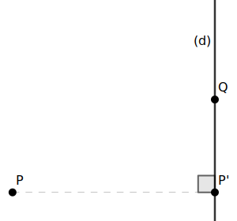
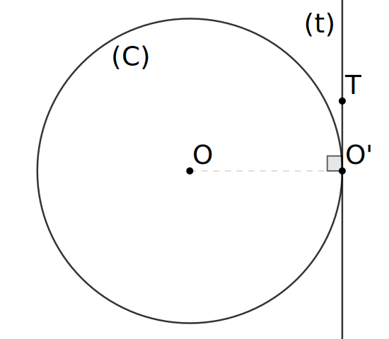

# Hệ quả vuông góc giữa bán kính đường tròn và tiếp tuyến của nó

Xuất phát từ hệ quả của định lý Pythagoras:

> *độ dài cạnh huyền luôn lớn hơn cạnh góc vuông.*

Đoạn thằng nối điểm $P$ nằm ngoài đường thẳng $d$ đến điểm bất kỳ $Q$ trên $d$ có đó độ dài đạt nhỏ nhất khi điểm $Q$ trên $d$ là hình chiếu $^{[1]} P'$ của $P$ lên $d$, nghĩa là $PQ\geq PP', \forall Q \in (d)$.

Tương tự

Cho $(C)$ tâm $O$ bán kính $R$, dựng đường thẳng $(t)$ tiếp xúc $(C)$ tại $O'$ (là tiếp điểm), với $T$ là điểm thuộc $(t)$, vì $(t)$ là tiếp tuyến của $(C)$ tại $O'$ khi đó ta cũng có: $OT\geq OO', \forall T \in (t)$. Điều này chứng tỏ tiếp điểm $O'$ là hình chiếu của tâm $O$ lên $(t)$.

Mặc khác, bán kính $R$ của $(C)$ thì bằng với khoảng cách $^{[2]}$ từ điểm $O$ đến $(t)$, tức $R=OO'$.

Vì vậy có thể kết luận: 

> bán kính có chứa tiếp điểm giữa một đường thẳng với đường tròn của nó thì vuông góc với đường thẳng đó tại tiếp điểm.

#

$^{[1]}$ Hình chiếu của một điểm lên đường thẳng là điểm thuộc đường thẳng sao cho đoạn thẳng nối hai điểm đó vuông góc đường thẳng.

$^{[2]}$ Khoảng cách từ một điểm đến đường thẳng là độ dài đoạn thẳng nối từ điểm đó đến hình chiếu của nó trên đường thẳng.