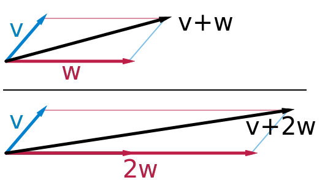
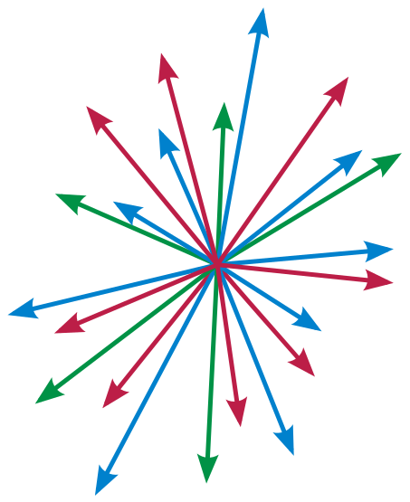

- [Vector (math)](#vector-math)
- [Không gian Vector](#không-gian-vector)

# Vector (math)

Khi kiến thức vector chưa được xây dựng một cách có hệ thống, ý tưởng về những *"đoạn thẳng định hướng"* đã sớm xuất hiện rất nhiều trong các công trình cơ học, hay khi có số phức, người ta cũng hình thành nên ý tưởng biễu diễn số phức dưới dạng hình học là những đoạn thẳng định hướng,... khiến nó trở thành đối tượng đáng quan tâm trong mắt các nhà toán học thế kỷ 19 như một điều thiết yếu.

Một đoạn thẳng được định hướng trong không gian Euclid (kể cả trong không gian cổ điển hay không gian toạ độ) bởi hai điểm đầu mút của nó khi một trong hai được xác định là điểm đặt (điểm đầu) của đoạn thẳng và điểm còn lại sẽ là điểm tới (điểm cuối) của đoạn thẳng, một đối tượng hình học như vậy có ý nghĩa là *"một lượng có phương hướng xác định"* đại diện biểu thị cho các đại lượng cần có thêm thông tin về phương hướng không gian và được gọi là *"Vector"*. Theo căn bản đó, trong không gian Euclid ta được thừa nhận rằng:

*\- các vector cùng nằm trên các đường thẳng song song với nhau hoặc trùng nhau được gọi là các vector cùng phương, chúng có thể cùng chiều hoặc ngược chiều*.

*\- các vector cùng hướng là các vector cùng phương, cùng chiều.*

*\- các vector bằng nhau là các vector có cùng độ dài, cùng hướng.*

*\- các vector đối nhau là các vector có cùng độ dài, cùng phương nhưng ngược chiều.*

Một vector v được viết kí hiệu: $\mathbf{v}$ (v in đậm) hoặc $\vec{\text{v}}$

hoặc khi đề cập đến độ dài hoặc độ lớn của nó ta viết: $\vert \mathbf{v}\vert$ hoặc $\vert \vec{\text{v}}\vert$, đôi khi $\Vert \mathbf{v}\Vert$ hoặc $\Vert \vec{\text{v}} \Vert$,...

Khi dựng các vector được kết hợp theo cách mà đầu của vector này được nối với đuôi của vector kia, sau đó luôn có thể có được "duy nhất" một đoạn thẳng nối từ *"đầu còn lại"* tới *"đuôi còn lại"* của chúng, một phép dựng hình như vậy, ở góc nhìn động học chẳng hạn, được nhìn nhận một cách "chủ quan nhưng không sai" rằng, đây là phép cộng giữa các vector dời vị trí của một chất điểm, tuân theo một quy tắc hình học gọi là *"quy tắc các hình tam giác".*

Mặt khác, chúng ta cần nhớ rằng, với bản chất của phép cộng, phép cộng giữa các đối tượng không có cùng định nghĩa, hoặc không có cùng bản chất, thì phép tính đó vô nghĩa. Giống như các đối tượng có bản chất số học được tập hợp trong cùng một tập hợp có bản chất số học, chẳng hạn: 

$$\mathbb{N}\subset\mathbb{Z}\subset\mathbb{Q}\subset\mathbb{R}\subset\mathbb{C}\subset...\subset S_\text{numbers}$$

Với các vector cũng vậy, các vector mà được cho là *"bằng nhau"*, dù đặt ở vị trí nào trong không gian đi nữa thì ở góc nhìn toán học nói chung, chúng phải được định nghĩa rằng: *"đây là một phần tử xác định trong một tập có định nghĩa chứa các đối tượng có bản chất vector (các vector khác), gọi là tập hợp* $V$*"*.

Theo đó khách quan mà nói, chính xác hơn, phép cộng giữa các vector bất kì có thể được thực hiện theo một quy tắc hình học bao hàm cả *quy tắc các hình tam giác* được gọi là *"quy tắc các hình bình hành"*, bất kể là trong không gian cổ điển hay không gian có toạ độ, quy tắc này hoàn toàn có thể được chứng minh một cách dễ dàng, hoặc là bằng các phương pháp của hình học tổng hợp, hay thuận tiện hơn là bằng các phương pháp được khái quát hoá từ các phương pháp của hình học tổng hợp là các phương pháp toạ độ (sets of vectors as points), bản chất vector của vector được cho là vector tổng thu được, căn bản là không bị thay đổi (không bị phá vỡ):

Trong không gian Euclide, vector có độ dài được quy ước bằng 1 được gọi là vector đơn vị (vector cơ sở), kí hiệu: $\hat{\mathbf{u}}$, với 

$$\hat{\mathbf{u}}=\frac{\mathbf{v}}{\Vert \mathbf{v} \Vert}$$

## Không gian Vector

Trong [*Đại số trừu tượng*](https://en.wikipedia.org/wiki/Abstract_algebra) (đại số hiện đại), tập hợp $V$ mà ta nói đến bên trên được trừu tượng hoá thành đối tượng được gọi là *Không gian vector (vector space)*.

"*Không gian (space)*" trong thuật ngữ "*không gian vector (vector space)*" là một thuật ngữ riêng của toán học thuần tuý, nó không ám chỉ định nghĩa trong từ điển ngôn ngữ thông thường (ví dụ: "*Không gian ngoài trời, không gian trong phòng,...*"), nó là một định nghĩa về **một tập hợp được trang bị một cấu trúc xác định mối quan hệ giữa các phần tử của tập hợp**. Trong trường hợp này, "*không gian vector*" là một định nghĩa về **một tập hợp vector (khác rỗng), mà trong đó, các vector có thể cộng với nhau hoặc nhân (tỉ lệ) và các phép toán đó đáp ứng một số yêu cầu nhất định, gọi là Hệ tiên đề (định đề) của không gian vector (hình thành không gian vector)**. 

Cụ thể:

Không gian vector trên trường $F$ (trường vô hướng) là tập hợp $V$ không rỗng được trang bị một phép toán nhị phân và một hàm nhị phân giữa các phần tử là vector thoã mãn hệ tiên đề sau:

1. Với mọi phần tử $x$ và $y$ trong $V$, $x+y$ cũng thuộc $V$.

2. Với mọi phần $x$ trong $V$ và phần tử $a$ trong $F$, $ax$ cũng thuộc $V$.

3. Với mọi phần tử $x$ và $y$ trong $V$, $x+y = y+x$. 

4. Với mọi phần tử $x$, $y$ và $z$ trong $V$, $(x+y)+z = x+(y+z)$.

5. Tồn tại một phần tử trong $V$ là vector không (zero vector) sao cho $x+\mathbf{0}=x$ với mọi $x \in V$.

6. Với mọi $x \in V$, tồn tại một phần tử $-x \in V$ sao cho $x+(-x)=0$.

7. Tồn tại một phần tử trong $F$ là $1$, với mọi $x \in V$, $1x=x$.

8. $\forall x \in V$ và $\forall a,b \in F$, $(ab)x=a(bx)$.

9. $\forall a \in F$ và $\forall x,y \in V$, $a(x+y)=ax+ay$.

10. $\forall x \in V$ và $\forall a,b \in F$, $(a+b)x= ax+bx$.

Trong không gian vector, "*trông giống như*" mỗi vector xác định, là kết quả của *"sự xoay, hoặc sự co giãn và xoay"* bởi phép cộng giữa các phần tử trên tập $V$ nói chung theo quy tắc các hình bình hành, hoặc *"sự co giãn"* bởi phép cộng giữa các phần tử trên tập $V$ có cùng hướng, phép cộng giữa các phần tử có cùng hướng như vậy còn được hiểu là phép nhân giữa một phần tử tập $V$ với một phần tử trường $F$ *(scalar multiplication, đừng nhầm lẫn với [scalar product](#)):*

$+:V\times V \rightarrow V$

$\times: F\times V \rightarrow V$

Kí hiệu không gian vector của tập $V$ (không gian vector $V$, không gian sinh ra bởi tập $V$):

$(V,+,\bullet)$ hoặc $\langle V \rangle$

Trên trường $F$, một tập hợp vector $W \subseteq V (W \neq V)$ mà thoả mãn hệ tiên đề như vậy (tức là đủ cơ sở để hình thành nên không gian vector), thì được gọi là không gian vector con của không gian vector $V$(sub-vector spaces) sinh ra bởi tập $W$, kí hiệu:

$(W,+,\bullet) \leq (V, +,\bullet)$ hoặc $\langle W \rangle \leq \langle V \rangle$

Ngược lại, $W$ chỉ cần vi phạm một trong các điều khoản của hệ tiên đề thì tập không đủ cơ sở hình thành một không gian vector, kí hiệu:

$\nexists (W,+,\bullet)$ hoặc $\nexists \langle W \rangle$