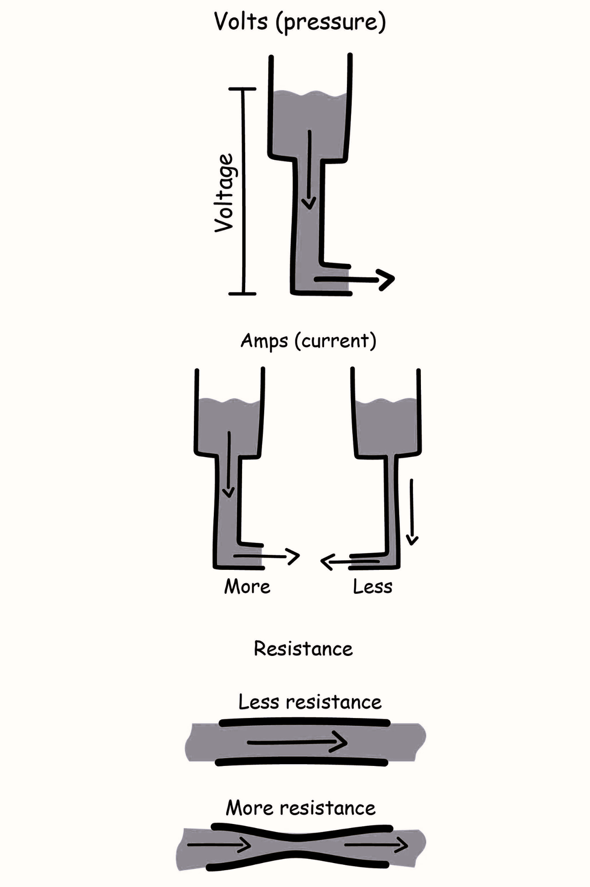
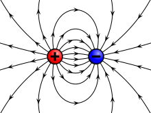

# Miếng hổ phách của Thales (Thalès amber piece)

Chuyện bắt đầu từ hơn 2.600 năm trước, có một người Hy Lạp cổ xưa, tên là Thales xứ Miletus được coi là người đầu tiên đã quan sát được điều mà ngày nay chúng ta gọi là hiện tượng điện. Ông phát hiện ra rằng một mảnh hổ phách, khi chà xát với lông thú, có thể hút những mẫu rơm nhỏ. Người ta chỉ biết đến như thế về điện trong một thời gian rất dài. Và phải chờ đợi gần 2.200 năm nữa trước khi có những cuộc điều tra mới về tính chất của hổ phách.

William Gilbert, một nhà khoa học người anh ở thế kỷ 17, bằng một vài thí nghiệm kỹ lưỡng, đã nhận thấy một vài chất liệu khác cũng có tính chất hút như của hổ phách và gọi chúng là vật tích điện. Ông ấy cũng khám phá ra rằng ngoài rơm, chúng có thể hút các vật khác nữa.

Kế tiếp đó, Charles du Fay có một khám phá quan trọng. Ông thấy rằng hầu hết các vật thể có thể trở thành vật tích điện sau khi cho chúng kết hợp giữa làm nóng và chà xát. Thêm vào đó ông thấy rằng, khi hai vật tích điện đặt gần nhau, có lúc chúng hút nhau, có lúc chúng đẩy nhau. Với thêm một chút kiến thức, du Fay có hai nhóm vật tích điện rõ ràng. Bất cứ hai vật trong cùng nhóm sẽ luôn đẩy nhau, khác nhóm sẽ hút nhau.

Ngoài ra, hầu hết kim loại là những thứ dễ dàng (tích) nhiễm điện sau khi tiếp xúc với một vật khác đã tích điện trước. Để giải thích hiện tượng vật lý này, sau đó một người Mỹ tên là Benjamin Franklin đã đưa ra giả thuyết về chất được gọi là lý thuyết "hai lưu chất điện". Đây là một trong những thuyết vật lý thô sơ để giải thích hiện tượng điện, dựa qua các thí nghiệm và quan sát thực tiễn mà người ta tiến hành xây dựng lý thuyết sao cho phù hợp.

Khi đó người ta lập luận rằng có hai loại lưu chất điện, lưu chất điện âm và lưu chất điện dương, hai vật chứa cùng loại thì đẩy nhau, khác loại thì hút nhau. Một vật được coi là trung hòa về điện nếu lưu lượng chất điện âm và lưu lượng chất điện dương của vật bằng nhau, hai vật trung hòa về điện thì không tác động lên nhau.

Dựa trên các lập luận của lý thuyết đã có, người ta cũng phỏng đoán chính xác các kết quả trên thí nghiệm với tĩnh điện nghiệm trước khi bắt tay vào thí nghiệm kỹ lưỡng với thiết bị vật lý thô sơ này.

Thanh cao su và miếng nỉ cả hai ban đầu đều trung hòa về điện, với việc cho chúng cọ xát (cưỡng ép dẫn) ta tạo ra một dòng chảy giữa các chất lưu điện giữa giữa hai vật với nhau, các lưu chất hai vật vật trộn lẫn vào nhau một cách ngẫu nhiên, khiến cho lưu lượng chất điện dương và âm của cả hai vật không còn cân bằng nhau như lúc ban đầu nữa, vì vậy cả hai trở thành vật tích điện. Cho thanh cao su sau khi cọ xát tiếp xúc với thanh kim loại (vật dẫn) của hai lá vàng, khi này lưu chất điện âm (quy ước) trên thanh cao su chảy vào kim loại khiến cho hai lá vàng nhiễm điện âm do vậy chúng đẩy nhau.

Trong khoa học cổ điển người ta thường xây dựng các khái niệm (lý thuyết) mới dựa trên phần lớn các quan sát gần gũi hay từ các khái niệm (lý thuyết) có trước. Để giải thích hiện tượng lưu chất điện âm từ thanh cao su chảy vào kim loại, người ta bắt đầu xây dựng các khái niệm mới là *Điện thế*, *Điện áp (hiệu điện thế)* để giải thích cho "sự chảy" này. Cũng giống như nước có xu hướng chảy từ nơi cao về nơi thấp thì người ta cũng cho rằng, có thể, lưu chất điện cũng có xu hướng chảy từ nơi có điện thế cao về nơi có điện thế thấp, nước mang xu hướng như vậy là do tác động từ phía trọng trường, vậy còn đối với lưu chất điện thì thứ gì đã tác động chúng? Dù có đặt thanh cao su bên dưới thanh kim loại thì hai lá vàng vẫn đẩy nhau đấy thôi, hiển nhiên không phải là trọng trường rồi!

Trong định luật vạn vật hấp dẫn của Newton nói rằng, tương tác hấp dẫn xảy ra giữa hai vật không tiếp xúc với nhau là vì vật này được đặt trong trường hấp dẫn của vật kia, một vật tác dụng lực hấp dẫn lên các vật khác ở gần nó vì xung quanh vật đó có (phát ra) trường hấp dẫn, đúng vậy, chúng ta đang nói về ý tưởng *Điện Trường* của Michael Faraday, thực thể vật lý đã được phát minh, định tính và định lượng sao cho phù hợp với hai sự kiện vật lý về hiện tượng điện trên nói riêng, cũng như các sự kiện khác về hiện tượng điện nói chung.

Vào thời Tesla (cuối thế kỷ 19), các khái niệm như điện thế, điện trường tuy đã có hình thức toán học rõ ràng, nhưng về mặt bản thể học (bản chất vật lý), vẫn còn bị ảnh hưởng mạnh bởi tư duy "lưu chất" (fluid model).

Tuy nhiên sau đó, vật lý hiện đại đã chứng minh được rằng, con người không phát minh ra điện từ trường, mà chúng thật sự tồn tại, vì vậy đây chính là một khám phá. Dĩ nhiên sau đó học thuyết thô sơ về lưu chất điện đã không còn đúng nữa và được thay thế bởi học thuyết về các hạt tải điện bên trong nguyên tử hay phân tử quen thuộc với chúng ta. Qua đó thấy rằng điện tích trên một vật có cấu tạo gián đoạn, điện lượng của nó luôn luôn bằng một số nguyên lần của một điện lượng nhỏ nhất gọi là điện tích cơ bản có độ lớn xấp xỉ $q=1.6 \times 10^{-19} C$ (Độ lớn của điện tích cơ bản do nhà vật lý Robert A. Millikan đo được lần đầu tiên trong thí nghiệm giọt dầu rơi năm 1909).
